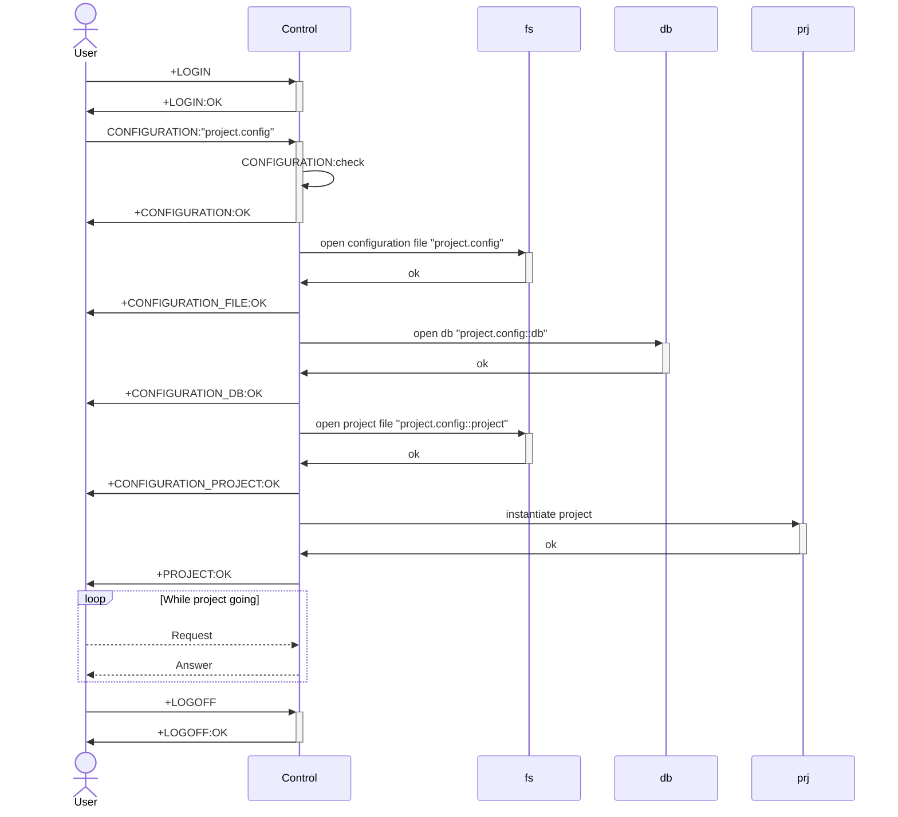
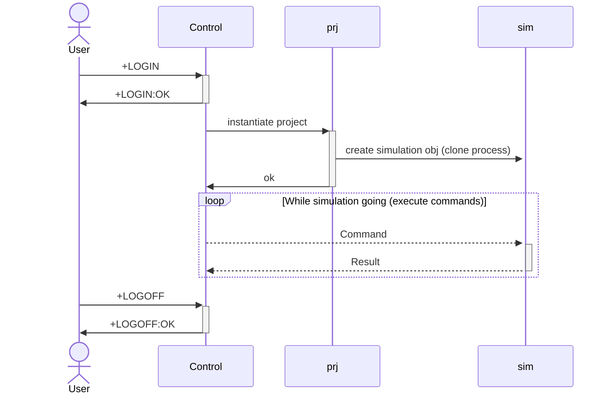

# Simulator 

## Architecture

Simulator has client - server architecture where server is a main component which works on client's requests of simulation project. 

Every simulation project consist of device configuration and logic. Every project keeps configuration in DB and project logic on file system. Every `Simulator Node` can provide any of base services : Database, Storage, Executor. It is possible to share working beatween all `Simulator Nodes` in net. First stage we implement only a node configuration with one database, one storage and one executor.

```mermaid
architecture-beta

    service user(mdi:human)[Client]
    group api(cloud)[Simulator Node]
    
    service server(server)[Server] in api

    service db(database)[Database] in api
    service disk1(disk)[Storage] in api
    service sim(mdi:desktop-tower)[Executor] in api

    user:R -- L:server

    server:R -- L:db
    server:R -- L:disk1
    server:R -- L:sim
    
```

## Object types

## Design

Simulation sequance for operating with project.

### General Sequance

### Simulation Start Sequance

When simulation activated it is waiting for commands from `User` or from `Control`. Results 
transferring to `Control` for logging.

